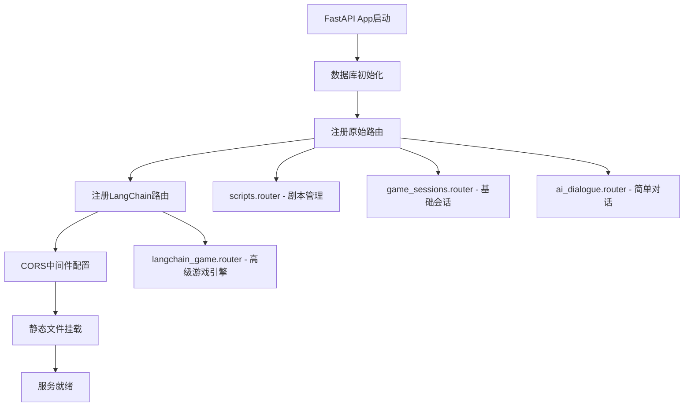
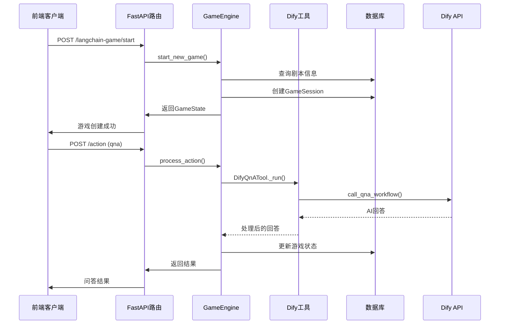

我将为您提供一个完整的快速启动和调试指南，让您能够迅速运行这个谋杀悬疑游戏后端系统。

## 🚀 快速启动指南

### 1. 环境配置和依赖安装

#### 1.1 Python环境准备
```bash
# 确保Python 3.9+
python --version

# 创建虚拟环境（推荐）
python -m venv venv

# 激活虚拟环境
# Windows:
venv\Scripts\activate
# Linux/Mac:
source venv/bin/activate
```

#### 1.2 安装依赖
```bash
# 安装所有依赖
pip install -r requirements.txt

# 如果遇到问题，可以分步安装核心依赖：
pip install fastapi uvicorn sqlalchemy pydantic requests
pip install langchain langgraph langchain-core langchain-community
pip install pytest pytest-asyncio pytest-mock
```

### 2. 数据库初始化

#### 2.1 自动初始化（推荐）
数据库会在首次启动时自动创建：
```python
# app/main.py 中已包含自动创建逻辑
database_models.Base.metadata.create_all(bind=engine)
```

#### 2.2 手动验证数据库
```bash
# 检查数据库文件是否创建
ls -la game_database.db

# 或使用SQLite工具查看表结构
sqlite3 game_database.db ".tables"
```

### 3. 环境变量配置

#### 3.1 创建 `.env` 文件（可选但推荐）
```bash
# 在项目根目录创建 .env 文件
touch .env
```

#### 3.2 关键配置项（基于当前打开的config.py）

````python path=app/core/config.py mode=EXCERPT
# 原始Dify API配置（用于简单对话）
DIFY_API_URL = os.getenv("DIFY_API_URL", "https://api.dify.ai/v1/chat-messages")
DIFY_API_KEY = os.getenv("DIFY_API_KEY", "YOUR_DIFY_APP_API_KEY")

# LangChain专用Dify工作流配置
DIFY_QNA_WORKFLOW_URL = os.getenv("DIFY_QNA_WORKFLOW_URL", "https://api.dify.ai/v1/workflows/run")
DIFY_QNA_WORKFLOW_API_KEY = os.getenv("DIFY_QNA_WORKFLOW_API_KEY", "YOUR_QNA_WORKFLOW_API_KEY")
DIFY_MONOLOGUE_WORKFLOW_URL = os.getenv("DIFY_MONOLOGUE_WORKFLOW_URL", "https://api.dify.ai/v1/workflows/run")
DIFY_MONOLOGUE_WORKFLOW_API_KEY = os.getenv("DIFY_MONOLOGUE_WORKFLOW_API_KEY", "YOUR_MONOLOGUE_WORKFLOW_API_KEY")
````

**最小配置（.env文件）**：
```bash
# 基础功能（剧本管理、原始对话）
DIFY_API_KEY=your_basic_dify_api_key

# LangChain高级功能（可选，用于测试时可以跳过）
DIFY_QNA_WORKFLOW_API_KEY=your_qna_workflow_key
DIFY_MONOLOGUE_WORKFLOW_API_KEY=your_monologue_workflow_key

# 可选配置
LANGSMITH_API_KEY=your_langsmith_key
MAX_QNA_PER_CHARACTER_PER_ACT=3
```

### 4. 启动后端服务

#### 4.1 开发模式启动
```bash
# 方法1：使用uvicorn直接启动
uvicorn app.main:app --reload --host 0.0.0.0 --port 8000

# 方法2：使用Python模块启动
python -m uvicorn app.main:app --reload --port 8000

# 启动成功后会看到：
# INFO:     Uvicorn running on http://127.0.0.1:8000 (Press CTRL+C to quit)
# INFO:     Started reloader process
```

#### 4.2 验证启动成功
```bash
# 检查根端点
curl http://localhost:8000/
# 预期响应：{"message": "Welcome to the Visual Novel Backend API!"}

# 检查API文档
# 浏览器访问：http://localhost:8000/docs
```

## 🏗️ 核心架构理解

### 1. 双重架构启动顺序



### 2. 最重要的10个核心组件

#### 2.1 启动和配置层
1. **`app/main.py`** - FastAPI应用入口
2. **`app/core/config.py`** - 统一配置管理（当前打开文件）
3. **`app/database.py`** - 数据库连接管理

#### 2.2 数据层
4. **`app/models/database_models.py`** - SQLAlchemy数据模型
5. **`app/langchain/state/models.py`** - Pydantic游戏状态模型

#### 2.3 服务层
6. **`app/services/dify_service.py`** - Dify AI集成服务
7. **`app/langchain/tools/dify_tools.py`** - LangChain工具包装

#### 2.4 控制层
8. **`app/routers/langchain_game.py`** - 新游戏引擎API
9. **`app/langchain/engine/game_engine.py`** - 游戏编排引擎
10. **`app/langchain/engine/graph.py`** - LangGraph状态机

### 3. 数据流向图



## 🔧 调试和验证

### 1. 验证双重API系统

#### 1.1 原始系统验证
```bash
# 1. 验证剧本管理
curl http://localhost:8000/api/v1/scripts

# 2. 验证基础对话（需要Dify API Key）
curl -X POST http://localhost:8000/api/v1/ai/dialogue \
  -H "Content-Type: application/json" \
  -d '{
    "session_id": "test_session",
    "question": "你好"
  }'
```

#### 1.2 LangChain系统验证
```bash
# 1. 创建新游戏（需要先有剧本数据）
curl -X POST http://localhost:8000/api/v1/langchain-game/start \
  -H "Content-Type: application/json" \
  -d '{
    "script_id": "test_script",
    "user_id": "test_user"
  }'

# 2. 获取游戏状态
curl http://localhost:8000/api/v1/langchain-game/session/{session_id}/status
```

### 2. 常见启动问题排查

#### 2.1 依赖问题
```bash
# 检查关键依赖
python -c "import fastapi, langchain, langgraph; print('Dependencies OK')"

# 如果LangChain导入失败
pip install --upgrade langchain langgraph
```

#### 2.2 数据库问题
```bash
# 检查数据库文件权限
ls -la game_database.db

# 删除并重新创建数据库
rm game_database.db
# 重启服务会自动重新创建
```

#### 2.3 端口占用问题
```bash
# 检查端口占用
netstat -an | grep 8000
# 或使用其他端口
uvicorn app.main:app --reload --port 8001
```

### 3. 日志和错误诊断

#### 3.1 启用详细日志
```python
# 在app/main.py开头添加
import logging
logging.basicConfig(level=logging.DEBUG)
```

#### 3.2 关键日志位置
- **启动日志**：uvicorn输出
- **数据库日志**：SQLAlchemy操作
- **Dify调用日志**：`app/services/dify_service.py`
- **游戏引擎日志**：`app/langchain/engine/game_engine.py`

## ⚡ 最短路径快速上手

### 1. 最小配置启动（5分钟）

```bash
# 1. 安装依赖
pip install fastapi uvicorn sqlalchemy pydantic requests

# 2. 启动服务（无Dify配置）
uvicorn app.main:app --reload

# 3. 验证基础功能
curl http://localhost:8000/
curl http://localhost:8000/api/v1/scripts
```

### 2. 添加基础AI功能（+5分钟）

```bash
# 1. 设置环境变量
export DIFY_API_KEY="your_dify_key"

# 2. 重启服务
# 3. 测试AI对话功能
```

### 3. 完整LangChain功能（+10分钟）

```bash
# 1. 安装LangChain依赖
pip install langchain langgraph langchain-core

# 2. 配置工作流API密钥
export DIFY_QNA_WORKFLOW_API_KEY="your_workflow_key"
export DIFY_MONOLOGUE_WORKFLOW_API_KEY="your_monologue_key"

# 3. 测试完整游戏功能
```

## 🎯 关键配置优先级

### 必需配置（系统启动）
1. **Python 3.9+** 和基础依赖
2. **数据库权限**（SQLite文件创建权限）

### 基础功能配置
3. **DIFY_API_KEY** - 原始对话功能
4. **剧本数据** - 可以手动添加测试数据

### 高级功能配置（可选）
5. **DIFY_QNA_WORKFLOW_API_KEY** - 问答工作流
6. **DIFY_MONOLOGUE_WORKFLOW_API_KEY** - 独白工作流
7. **LANGSMITH_API_KEY** - 调试追踪（可选）

## 🛠️ 推荐调试工具

### 1. API测试
- **Swagger UI**: http://localhost:8000/docs
- **Postman** 或 **curl** 命令
- **httpie**: `pip install httpie`

### 2. 数据库查看
```bash
# SQLite命令行工具
sqlite3 game_database.db
.tables
.schema scripts
SELECT * FROM scripts LIMIT 5;
```

### 3. 日志监控
```bash
# 实时查看日志
tail -f uvicorn.log

# 或在启动时直接查看
uvicorn app.main:app --reload --log-level debug
```

按照这个指南，您应该能在15-20分钟内让整个系统运行起来，并且理解核心架构的工作原理。如果遇到具体问题，可以根据错误信息进行针对性排查。
